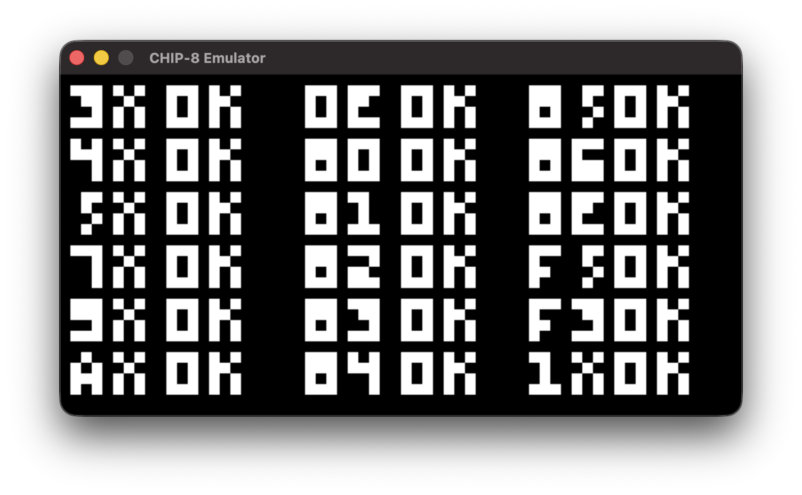

# CHIP-8 Emulator

A **CHIP-8 emulator** written in **Python**, built as a learning project while following [Austin Morlan's CHIP-8 emulator tutorial](https://austinmorlan.com/posts/chip8_emulator/).

The emulator implements the CHIP-8 virtual machine, including its memory, registers, stack, timers, keypad, display, opcode decoding, and an SDL2-based platform layer.


## Table of Contents

- [Features](#features)
- [Project Structure](#project-structure)
- [Requirements](#requirements)
- [Installation](#installation)
- [Running the Emulator](#running-the-emulator)
  - [Command-Line Arguments](#command-line-arguments)
  - [Example](#example)
- [Architecture](#architecture)
- [CPU Cycle](#cpu-cycle)
- [Opcode Dispatch](#opcode-dispatch)
- [Keyboard Mapping](#keyboard-mapping)
- [Display](#display)
- [Timing](#timing)
- [ROMs and Testing](#roms-and-testing)
  - [Opcode Test ROM](#opcode-test-rom)
  - [Game ROMs](#game-roms)
- [SDL2 Platform Layer](#sdl2-platform-layer)
- [Learning Goals](#learning-goals)
- [Future Improvements](#future-improvements)
- [References](#references)
- [License](#license)


## Features

- 4 KB CHIP-8 memory
- 16 8-bit general-purpose registers (`V0`–`VF`)
- 16-level call stack
- `I` index register
- Program counter (`PC`)
- Delay and sound timers
- 16-key CHIP-8 keypad
- 64×32 monochrome display
- Built-in CHIP-8 fontset
- Opcode dispatch tables
- ROM loading
- SDL2 window and texture rendering
- Keyboard input mapped to the CHIP-8 keypad
- Support for running CHIP-8 games


## Project Structure

The project is organized as follows:

```text
CHIP-8 Emulator/
├── chip8.py             # CHIP-8 virtual machine and opcode implementation
├── platform_sdl.py      # SDL2 window, rendering, and keyboard input
├── main.py              # Emulator entry point and main execution loop
├── roms/
│   └── test_opcode.ch8  # CHIP-8 opcode test ROM
└── README.md
```

The `roms/` directory is where CHIP-8 ROMs can be stored and loaded by the emulator.


## Requirements

- Python 3
- NumPy
- PySDL2
- `pysdl2-dll` for SDL2 binaries


## Installation

### 1. Clone the repository

```bash
git clone https://github.com/SpacianSPIFF/CHIP-8-PyEmulator
cd CHIP-8-PyEmulator
```

### 2. Create a virtual environment

```bash
python3 -m venv venv
source venv/bin/activate
```

### 3. Install dependencies

```bash
pip install numpy pysdl2 pysdl2-dll
```

## Running the Emulator

The emulator is launched from the command line:

```bash
python3 main.py <Scale> <Delay> <ROM>
```

### Command-Line Arguments

| Argument | Description |
|---|---|
| `Scale` | Multiplier for the CHIP-8's 64×32 display |
| `Delay` | Approximate delay between CPU cycles, in milliseconds |
| `ROM` | Path to the CHIP-8 ROM |

### Example

To run the opcode test ROM stored in the `roms/` directory:

```bash
python3 main.py 10 1 roms/test_opcode.ch8
```

With a scale of `10`, the 64×32 CHIP-8 display becomes:

```text
64 × 10 = 640
32 × 10 = 320
```

so the emulator window renders at approximately **640×320 pixels**.

The output of the test ROM should be such:


Press **Escape** to close the emulator.


## Architecture

The emulator is divided into two major layers:

```text
                    CHIP-8 Emulator
                           │
              ┌────────────┴────────────┐
              │                         │
              ▼                         ▼
          chip8.py                platform_sdl.py
        CHIP-8 Virtual Machine          SDL2
              │                         │
              ├── Memory                ├── Window
              ├── Registers             ├── Renderer
              ├── Stack                 ├── Texture
              ├── Timers                └── Keyboard
              ├── Keypad
              └── Display
                           ▲
                           │
                         main.py
                    Emulator main loop
```

### `chip8.py`

Contains the CHIP-8 virtual machine itself:

- CPU state
- Memory
- Registers
- Stack
- Timers
- Keypad state
- Framebuffer
- Opcode decoder
- Opcode implementations
- ROM loading

### `platform_sdl.py`

Handles communication with the host system through SDL2:

- Creating the window
- Creating the renderer
- Creating the texture
- Updating the framebuffer
- Processing keyboard events
- Mapping keyboard keys to CHIP-8 keys
- Cleaning up SDL resources

### `main.py`

Connects the virtual machine and platform layer and runs the main emulator loop.


## CPU Cycle

Each CHIP-8 CPU cycle follows the basic:

**Fetch → Decode → Execute** process.

1. Fetch the next two bytes from memory.
2. Combine them into a 16-bit opcode.
3. Increment the program counter by 2.
4. Decode the opcode using the dispatch tables.
5. Execute the corresponding instruction.
6. Update the delay and sound timers.

Conceptually:

```text
       Memory
          │
          │ fetch 2 bytes
          ▼
       Opcode
          │
          │ decode
          ▼
    Opcode Table
          │
          ▼
     Instruction
          │
          ▼
      CPU State
```

The CHIP-8 program counter starts at `0x200`, since the lower portion of memory is reserved for the interpreter and font data.


## Opcode Dispatch

Rather than using a large chain of `if`/`elif` statements, the emulator uses **function dispatch tables**.

For example:

```python
self.table = [self.OP_NULL] * 16

self.table[0x1] = self.OP_1nnn
self.table[0x2] = self.OP_2nnn
self.table[0x8] = self.Table8
```

The first hexadecimal digit of the opcode selects the main table:

```python
self.table[(self.opcode & 0xF000) >> 12]()
```

Some opcode families need another level of decoding, so additional tables are used:

- `table0`
- `table8`
- `tableE`
- `tableF`

For example, an opcode beginning with `8` is routed to `table8`, where its final nibble determines which arithmetic or bitwise operation should be executed.

This approach mirrors the dispatch-table design used in Austin Morlan's C++ implementation.


## Keyboard Mapping

CHIP-8 has a 16-key hexadecimal keypad:

```text
1 2 3 C
4 5 6 D
7 8 9 E
A 0 B F
```

The emulator maps it to a regular keyboard:

```text
1 2 3 4
Q W E R
A S D F
Z X C V
```

Complete mapping:

```text
CHIP-8       Keyboard

1 2 3 C      1 2 3 4
4 5 6 D      Q W E R
7 8 9 E      A S D F
A 0 B F      Z X C V
```

`Escape` closes the emulator.


## Display

The CHIP-8 display is:

```text
64 × 32 pixels
```

The emulator stores the framebuffer as a flat array and sends it to an SDL2 streaming texture for rendering.

The `Dxyn` instruction draws sprites onto this framebuffer and performs the CHIP-8 XOR-based collision behavior.

One important part of the implementation is **screen wrapping**: sprites that move past an edge of the 64×32 display continue from the opposite side.


## Timing

The `Delay` command-line argument controls the approximate time between CPU cycles.

For example:

```bash
python3 main.py 10 1 roms/test_opcode.ch8
```

uses an approximately **1 millisecond** minimum interval between CPU cycles.

The traditional CHIP-8 timers operate at **60 Hz**, independently from the CPU instruction rate. The current implementation keeps the timing model intentionally simple as part of the learning process.

A more accurate emulator could eventually separate:

- CPU frequency
- Delay timer frequency
- Sound timer frequency
- Rendering frequency


## ROMs and Testing

The `roms/` directory is intended to contain CHIP-8 programs used for testing and experimentation.

### Opcode Test ROM

The project uses the **CHIP-8 Test ROM** by `corax89`:

**Repository:**  
https://github.com/corax89/chip8-test-rom

The repository describes itself as a ROM for testing CHIP-8 emulators and includes an opcode test ROM. The test covers instructions including:

```text
3XNN    00EE    8XY5
4XNN    8XY0    8XY6
5XY0    8XY1    8XYE
7XNN    8XY2    FX55
9XY0    8XY3    FX33
ANNN    8XY4    1NNN
```

The test ROM is stored locally as:

```text
roms/test_opcode.ch8
```

Run it with:

```bash
python3 main.py 10 1 roms/test_opcode.ch8
```

### Game ROMs

For additional CHIP-8 programs and games, a useful collection is the `roms/games` directory from David Matlack's CHIP-8 repository:

**Repository:**  
https://github.com/dmatlack/chip8/tree/master/roms/games

To run another ROM, place it in the `roms/` directory and pass its path to `main.py`.

For example:

```bash
python3 main.py 10 1 "roms/file_name.ch8"
```

> **ROM licensing:** ROMs are separate from this emulator project. Check the respective repository and ROM author's licensing/usage terms before redistributing ROM files.


## SDL2 Platform Layer

`platform_sdl.py` handles everything that interacts with the host computer:

- SDL2 initialization
- Window creation
- Renderer creation
- Texture creation
- Framebuffer updates
- Keyboard events
- CHIP-8 keypad mapping
- SDL2 cleanup

Keeping this separate from `chip8.py` means the CHIP-8 CPU implementation is not tightly coupled to the platform layer.


## Learning Goals

This project was built primarily as a learning exercise to understand:

- How virtual CPUs work
- Instruction fetching and decoding
- Opcode dispatch
- Memory addressing
- Registers and stacks
- Function tables
- Timers
- Framebuffer rendering
- Basic SDL2
- The basic architecture of an emulator

The goal was not just to make CHIP-8 games run, but to understand **what is actually happening inside an emulator**.


## Future Improvements

Possible next steps include:

- [ ] Add sound output for the sound timer
- [ ] Add a proper emulator debugger
- [ ] Separate CPU frequency from the 60 Hz timers


## References

### CHIP-8 Emulator Tutorial

Austin Morlan's CHIP-8 emulator tutorial, which this project follows as a learning reference:

https://austinmorlan.com/posts/chip8_emulator/

### CHIP-8 Test ROM

`corax89/chip8-test-rom`:

https://github.com/corax89/chip8-test-rom

### CHIP-8 Game ROMs

`dmatlack/chip8` — game ROM collection:

https://github.com/dmatlack/chip8/tree/master/roms/games

### CHIP-8 Documentation

CHIP-8 overview:

https://en.wikipedia.org/wiki/CHIP-8

### SDL2

https://www.libsdl.org/

### PySDL2

https://pysdl2.readthedocs.io/


## License

This is a personal learning project.

If code, documentation, or ROMs are taken from or derived from other projects, please follow the original project's license and attribution requirements.
